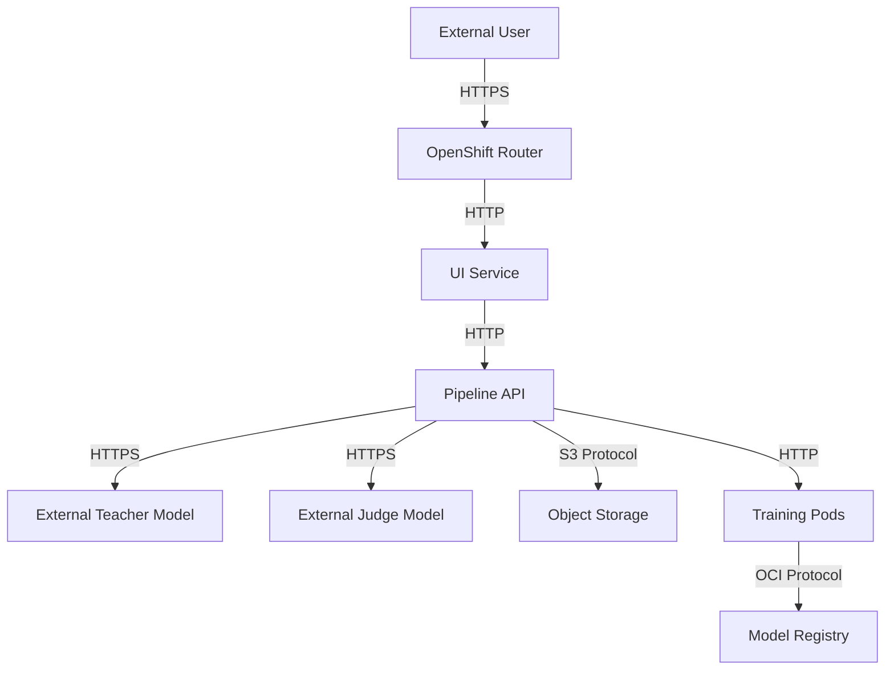

# InstructLab Network Flow Architecture

This document describes the network architecture and data flow within the system.

## Network Topology

## Key Network Flows

### User Access Flow
1. Users access the UI through the OpenShift Router via HTTPS
2. UI communicates with the Pipeline API to manage workflows
3. Pipeline API initiates and monitors training jobs

### Data Flow
1. Training data is retrieved from Object Storage
2. External models (Teacher and Judge) are accessed via secure HTTPS connections
3. Training output is stored in Object Storage
4. Final models are published to the OCI Registry

## Network Security Controls

1. **TLS Termination** - All external connections use TLS encryption
2. **Service Mesh** - Internal services communicate through the service mesh
3. **Network Policies** - Kubernetes network policies restrict pod-to-pod communication
4. **API Authentication** - All API calls are authenticated using token-based authentication

## Network Configuration Details

### External Access

| Component | Protocol | Port | Authentication | Route |
|-----------|----------|------|---------------|-------|
| UI        | HTTPS    | 443  | OpenShift Auth | `/` |
| Pipeline API | HTTPS | 443 | Token | `/api/v1/pipelines` |
| Model Serving | HTTPS | 443 | Token | `/api/v1/models` |

### Internal Communication

| Source | Destination | Protocol | Port | Authentication |
|--------|-------------|----------|------|---------------|
| UI | Pipeline API | HTTP | 8080 | Service Account |
| Pipeline | Training Pods | HTTP | 8080 | Service Account |
| Training Pods | Object Storage | HTTPS | 443 | Service Account |