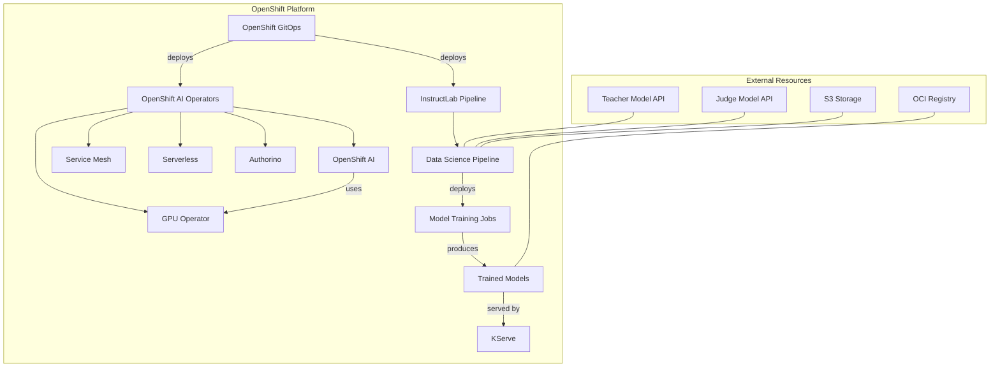

# InstructLab on OpenShift Architecture Overview

InstructLab is deployed on OpenDataHub / Red Hat OpenShift AI, leveraging OpenShift's Kubernetes foundation and OpenShift AI's machine learning capabilities.

## System Architecture

The following diagram shows the high-level architecture of InstructLab:

## Key Components

1. **OpenShift GitOps** - Manages the deployment of all components using Argo CD
2. **OpenShift AI** - Provides the data science platform capabilities
3. **GPU Operator** - Enables access to NVIDIA GPUs for accelerated computing
4. **Data Science Pipeline** - Orchestrates the machine learning workflows
5. **External Models** - Teacher and Judge models accessed over APIs
6. **Storage** - S3-compatible storage for pipeline artifacts
7. **Model Registry** - OCI registry for storing trained models

## Architecture Principles

1. **GitOps-Driven** - All configuration is stored in Git and applied through GitOps
2. **Environment Separation** - Clear separation between development and production
3. **Secure by Design** - All connections secured, secrets managed appropriately
4. **Scalable** - Components sized appropriately for workload with ability to scale
5. **Observable** - Comprehensive monitoring and logging