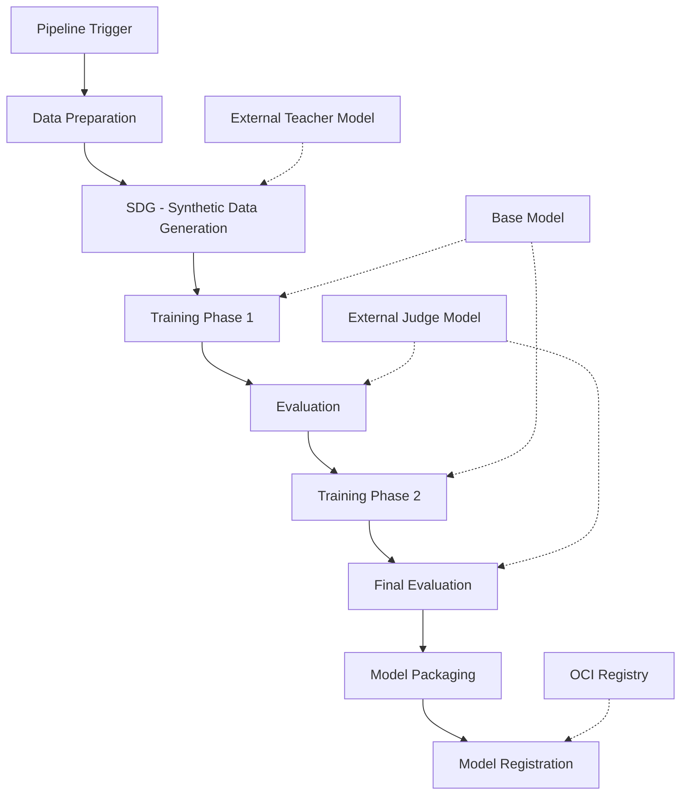

# InstructLab Pipeline Overview

The InstructLab pipeline is a machine learning workflow that trains language models using the instructional fine-tuning approach.

## Pipeline Architecture

The InstructLab pipeline is built on OpenShift AI's Data Science Pipeline, which is based on Kubeflow Pipelines.

## Pipeline Workflow

1. **Pipeline Trigger** - The pipeline is triggered via the OpenShift AI dashboard or CLI
2. **Data Preparation** - Data is prepared for training
3. **Synthetic Data Generation (SDG)** - Training data is generated using the Teacher model
4. **Training Phase 1** - Initial model training
5. **Evaluation** - Model evaluation using the Judge model
6. **Training Phase 2** - Further model training based on evaluation results
7. **Final Evaluation** - Final model evaluation
8. **Model Packaging** - Model is packaged for deployment
9. **Model Registration** - Model is registered in the registry

## Pipeline Inputs

The pipeline accepts several inputs:

- **Base Model** - The foundation model to be fine-tuned
- **Taxonomy Repository** - Repository containing the instruction taxonomy
- **Output Model URI** - URI for the output model
- **Configuration Parameters** - Various parameters controlling the pipeline execution

## Pipeline Outputs

The pipeline produces:

- **Trained Model** - The fine-tuned model
- **Evaluation Results** - Metrics from model evaluation
- **Training Logs** - Logs from the training process
- **Artifacts** - Various artifacts produced during the pipeline execution

## Pipeline Requirements

To run the pipeline, you need:

- **OpenShift AI** - The underlying platform
- **GPU Resources** - For model training
- **External Models** - Access to Teacher and Judge models
- **Storage** - For training data and artifacts
- **OCI Registry** - For model storage

## Pipeline Components

The pipeline is composed of several components:

- **Data Science Pipeline Application (DSPA)** - The pipeline infrastructure
- **Pipeline Definition** - The pipeline workflow definition
- **Pipeline Tasks** - Individual tasks within the pipeline
- **Pipeline Resources** - Resources used by the pipeline

## Pipeline Integration

The pipeline integrates with:

- **OpenShift AI Dashboard** - For pipeline management
- **External Models** - For data generation and evaluation
- **Object Storage** - For data storage
- **OCI Registry** - For model storage
- **Monitoring Systems** - For pipeline monitoring